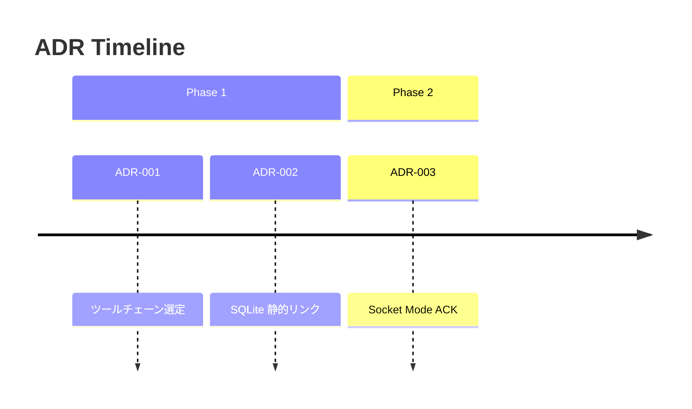
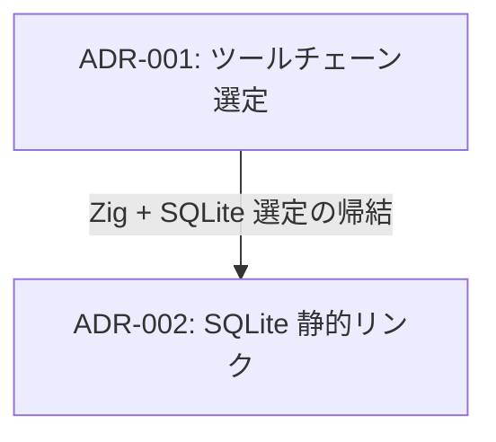

# ADR Retrospective

ADR を「点」ではなく「線・面」で捉え、意思決定の流れとパターンを可視化する。

## When to Use

- 定期的な振り返り（スプリントレトロ、月次レビュー）
- 新メンバーのオンボーディング
- 「同じ議論を繰り返している気がする」とき
- 技術的負債の棚卸し
- ADR が 5 件以上溜まったとき

## 分析プロセス

5つのレンズで順に分析する。全レンズを毎回やる必要はない — 目的に応じて選ぶ。

### Lens 1: Timeline（線）

`_decisions/` の全 ADR + `git log --grep="ADR-"` を読み、時系列に並べる。

出力: Mermaid timeline



**観点:**
- ADR が集中している時期 = 大きな設計判断が発生した時期
- ADR が空白の時期 = 記録漏れか安定期か？

### Lens 2: Dependency Graph（線）

ADR 間の親子・因果関係を特定する。

判定基準:
- Context に別の ADR 番号が出現 → 明示的依存
- 同じモジュール/ライブラリに言及 → 暗黙的依存
- Consequences が別の ADR の Context になっている → 因果連鎖

出力: Mermaid flowchart



**観点:**
- 「親 ADR」が多い決定 = アーキテクチャの要。変更時の影響が大きい
- 孤立した ADR = 独立した判断。良いことも悪いこともある

### Lens 3: Theme Clusters（面）

ADR をテーマ別にグルーピングする。

よくあるテーマ軸:
- **ポータビリティ/配布**: ビルド・リンク・パッケージング
- **接続安定性**: WebSocket, HTTP, リトライ
- **外部 API 追従**: Slack API, 認証, OAuth
- **開発プロセス**: CI/CD, テスト, ドキュメント
- **セキュリティ**: 認証, 暗号化, 入力検証

**観点:**
- 同じテーマに ADR が集中 → そのテーマが設計の主戦場
- テーマが偏っている → 見落としている領域がないか？

### Lens 4: Rejected Alternatives Radar（面）

全 ADR の Considered Alternatives を抽出し、以下を確認:

1. **再浮上チェック**: 過去に棄却した選択肢が、新しい ADR で再検討されていないか
2. **棄却理由の有効性**: 棄却理由が今も有効か（技術進歩、状況変化で無効化されていないか）
3. **未記録の棄却**: Considered Alternatives セクションがない ADR を列挙

出力:

| ADR | 棄却した選択肢 | 棄却理由 | 今も有効？ |
|-----|--------------|---------|-----------|
| 002 | 動的リンク | Nix 外で動かない | Yes |
| 004 | リトライのみ | 実際に失敗した | Yes |

### Lens 5: Technical Debt Ledger（面）

全 ADR の Consequences からネガティブ項目を抽出し、未解決の技術的負債を一覧化する。

出力:

| 出典 | 負債内容 | 状態 | 対応 ADR |
|------|---------|------|---------|
| ADR-004 | リトライ中 UI ブロック | 未解決 | - |
| ADR-005 | 10MB 超ダウンロード未対応 | 未解決 | - |

**状態の判定:**
- `git log` で関連修正があれば「解決済み」
- 後続 ADR で対応されていれば「ADR-NNN で対応」
- どちらもなければ「未解決」

## 出力フォーマット

分析結果は以下の構造で出力する:

```markdown
# ADR Retrospective — YYYY-MM-DD

## Summary
- ADR 総数: N 件（前回比 +M）
- 期間: YYYY-MM-DD 〜 YYYY-MM-DD
- 主要テーマ: ...

## Timeline
(Mermaid diagram)

## Dependency Graph
(Mermaid flowchart)

## Theme Clusters
(テーマ別テーブル)

## Rejected Alternatives Radar
(棄却選択肢テーブル)

## Technical Debt Ledger
(負債一覧テーブル)

## Insights
1. (発見・気づき)
2. ...

## Action Items
- [ ] (次にやるべきこと)
```

## Common Mistakes

| ミス | 対策 |
|------|------|
| ADR だけ読んで commit log を見ない | ADR に記録されていない判断が commit log にある。必ず `git log` も確認 |
| 全レンズを毎回やって冗長になる | 目的に応じてレンズを選ぶ。定期振り返りなら Lens 1+5、深掘りなら全部 |
| Mermaid の日本語ラベルでパーサーが壊れる | ノードラベルは `["..."]` で囲む |
| 「ADR を書くべきだった」で終わる | 具体的な ADR 候補をタイトル付きで挙げる |
